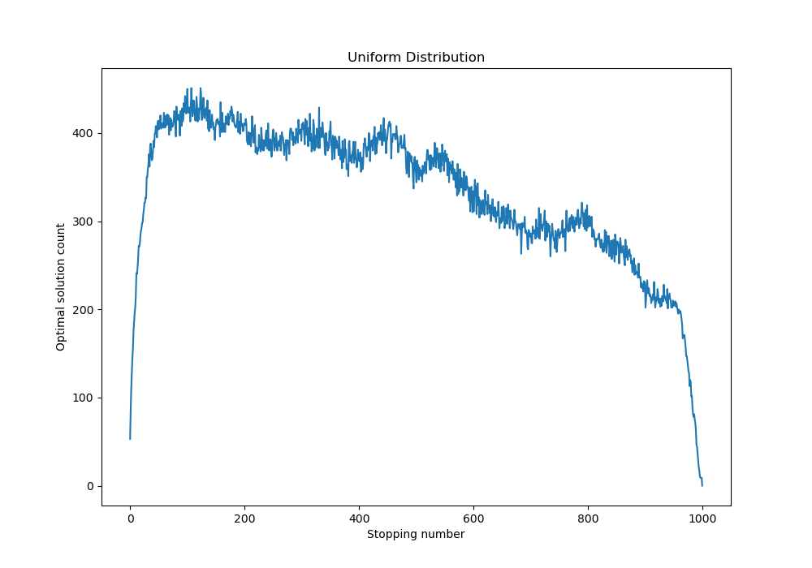
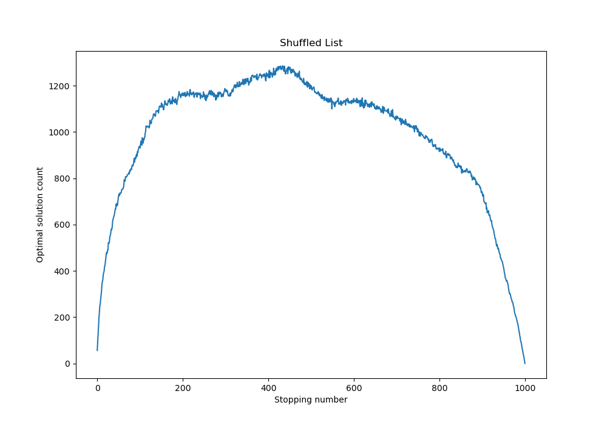
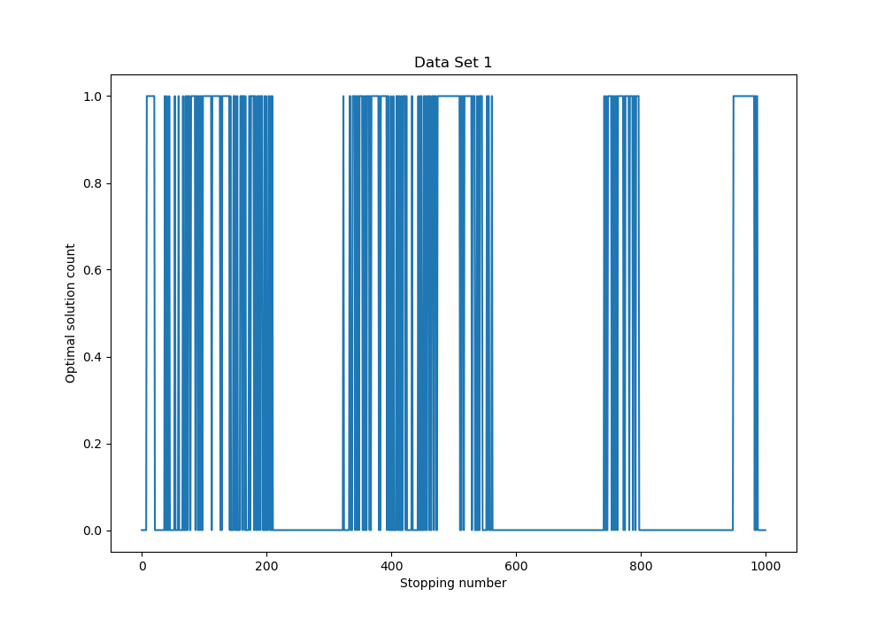
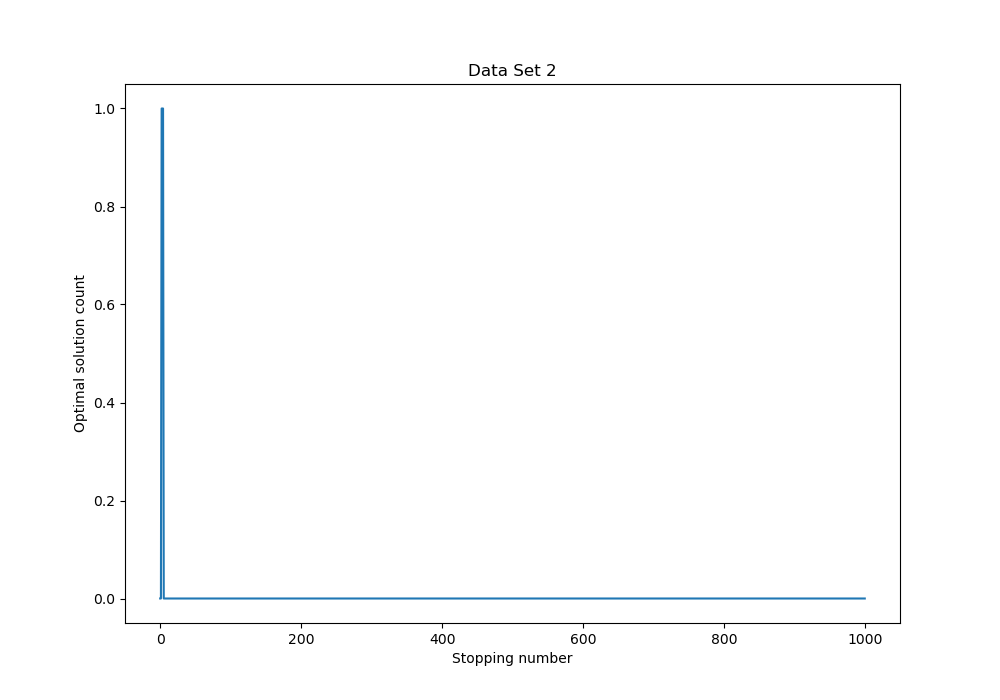
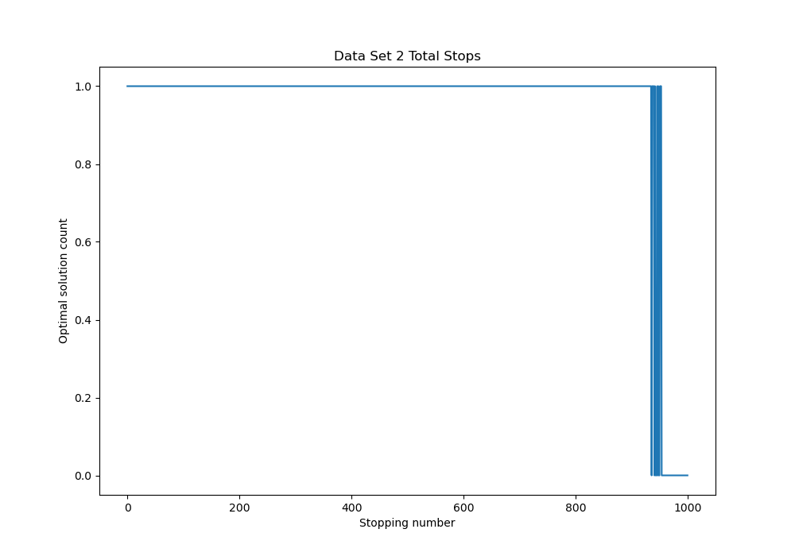
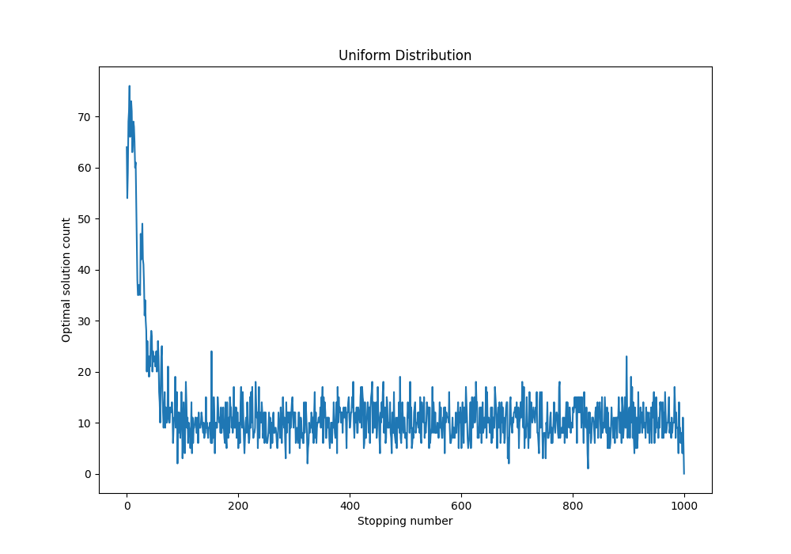
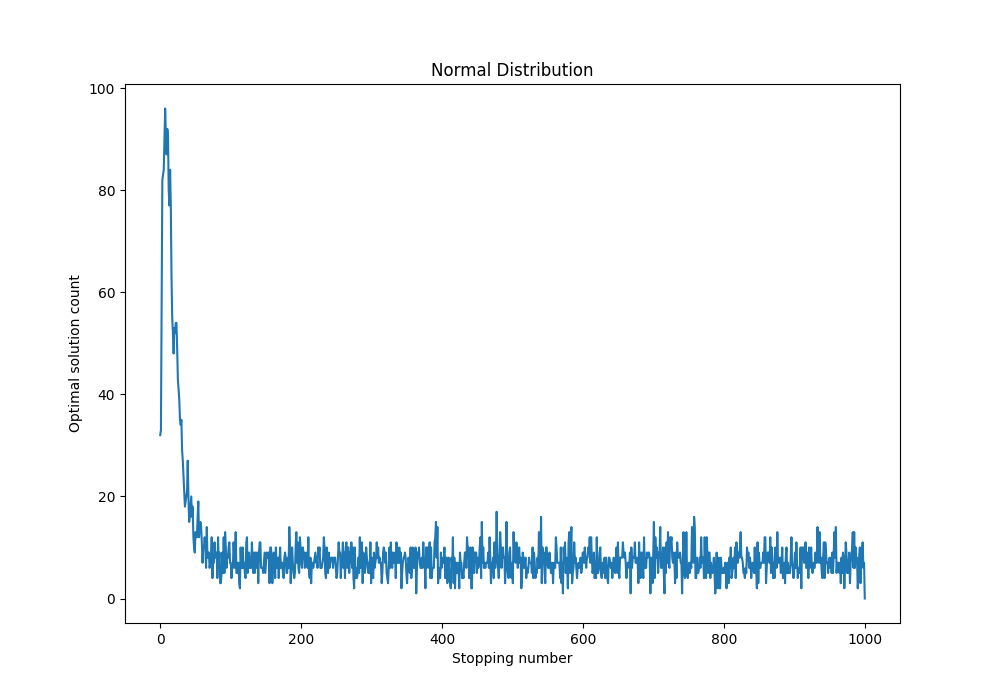

# Runnning Code
		To run the code all that needs to be done is run the HWK file. The main function then calls problem1 and problem2. The only difference between problem 1 and 2 is the stopping algorithm run on each list. For problem 1 the vanilla function is used, and problem 2 uses the max benefit function. The get optimal stop takes a callable which produces the lists so the numbers in the list are generated from the function it is given.
		Running the code produces 7 graphs:
		- Problem 1
			- Uniform Distribution from 0-99
			- Shuffled list (list containing 0-9999 in the regular problem)
			- Scenario 1
			- Scenario 2
			- Scenario 2 All Stops
		- Problem 2
			- Uniform Distribution (1-99)
			- Normal Distribution (1-99)

# Problem 1

	For the first problem I used what is essentially the vanilla stopping algorithm with a slight addition. This addition essentially randomly lowers the expectation of the stopper as it gets closer to the end of the list. I accomplish this by generating a random number and only decrementing the expectation if it is larger than the percentage of the list left to select from. This allows the algorithm to pick the correct solution if the optimal solution occurs early in the list for uniform distributions. However this has an adverse effect on randomly shuffled lists as this document will show.

## Results

This section shows the results from problem one. The results include a optimal stopping number and a graph showing the number of optimal stops at each index.

### Uniform

Stop %: 13

Stop % Probability: 43%

The output from the code shows the optimal stopping point of the uniform distribution with the vanilla stopping algorithm of 13%. This makes sense because if the list is populated 0 to n numbers then all of the numbers are likely to occur in the first n elements. This means the optimal solution is likely to be in the n first elements quite early in the list and thus the stopper should stop early to avoid the optimal number being the expectation.

### Shuffled List

Stop %: 43%

Stop % Probability: 12%

This graph shows the problem as outlined in the slides with a number only occuring once in the list. The code ouputs a optimal stop of 43% of the length of the list. This is sufficiently close to the 36.8 % number given by the book. The reason why it is not the exact number is due to the fall through condition for the uniform numbers. In the shuffled list, no number is the same, so the likelyhood of a number being greater than the expectation is fairly high as their are more options. The fallthrough condition reduces the effectiveness of the shuffled list because there is a substantially higher chance that reducing the expectation will cause it to pick a non-optimal solution. However, without the fall throuhg condition, the algorithm produces the expected 37% and 37%.

### Scenario 1

Stop %: N/A (cant pick the best without more runs)

Stop % Probability: N/A

This graph shows the same result of Uniform graph but has significantly less resolution because the algorithm was run on a single list. As mentioned before, the likelyhood of the optimal solution occuring is much higher in a uniform distribution making the best stopping point early in the list.

### Scenario 2

Stop %: N/A

Stop % Probability: N/A

This graph shows the downfall of using the vanilla stopping algorithm on a single list. The algorithm fails because the algorithm forms and expectation before it starts selecting stopping points. Meaning that if the optimal solution occurs early in the list the rule of stopping at 36.8 % will fail to choose the optimal solution.

However, when looking at the total stops graph, the fall through condition of reducing the expectation allows the algorithm to pick answers eventhough they may not be optimal. The fallthrough condition then prevents the algorithm from completely failing in the case that the optimal solution is found early in the list.

# Problem 2

For this problem I made a seperate stopping function the picks the value with the maximum benefit. The problem to be solved is how much exploration should be done before picking a candidate if rating candidates has a cost. For the optimal value, the algorithm selects the largest number in the list after subtracting its index. For the expectation, the best candidate is the highest number before stopping minus the stopping number. Then, stopping is the same as the vanilla stopping algorithm but finding a number - index that is higher than the expectation.

## Results

Stop %: 1%

Stop % Probability: 14%

This graph shows the results of the algorithm on a uniform draw of 100 numbers from 1-99. As expected by the constraints of the problem, the optimal stopping percentage is 1%  and the odds of picking the optimal number is 12% as forming an expectation is costly. However, this is likely because the cost of passing up a number is 1% of the total reward. This then explains the optimal stopping percentage because forming a better expectation reduces the potential reward in the future.

Stop %: 1%

Stop % Probability: 13.5%

The graph above shows the max benefit algorithm running on a set of 100 numbers generated by a normal distribution with a mean of 50 and std Dev of 10. I found the optimal stopping percentage is 1% with a probability of 10%. The percent success rate is likely lower because the likelyhood of a high number like 99 is very unlikely. As a result of this, there is a higher probability of a high number occuring later in the list that is still the best. This is reflected in the graph because the number of succesful stops drops off slightly slower than the uniform graph.

