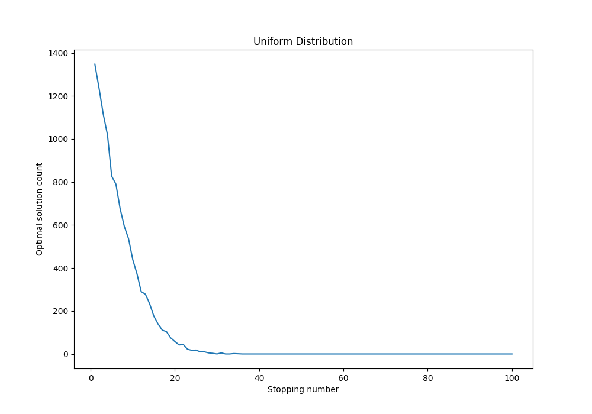
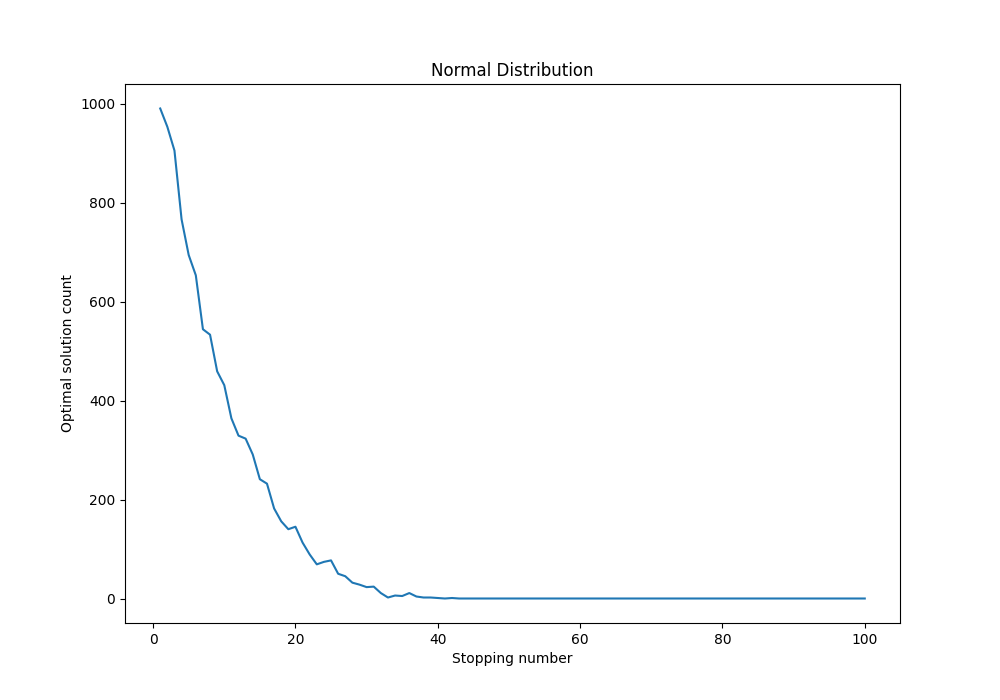

# Runnning Code
		To run the code all that needs to be done is run the HWK file. The main function then calls problem1 and problem2. The only difference between problem 1 and 2 is the stopping algorithm run on each list. For problem 1 the vanilla function is used, and problem 2 uses the max benefit function. The get optimal stop takes a callable which produces the lists so the numbers in the list are generated from the function it is given.

		NOTE: TO get control graph Fall through condition must be commented out.

		Running the code produces 7 graphs:
		- Problem 1
			- Shuffled Control
			- Uniform Control (0-99)
			- Uniform Fall Through (0-99)
			- Shuffled Fall Through (list containing 0-9999 in the regular problem)
			- Scenario 1
			- Scenario 1 Fall Through
			- Scenario 2
			- Scenario 2 All Stops
		- Problem 2
			- Uniform Distribution (1-99)
			- Normal Distribution (1-99)

# Problem 1

For the first problem I used what is essentially the vanilla stopping algorithm with a slight addition.
This addition essentially randomly lowers the expectation of the stopper as it gets closer to the end of the list.
I accomplish this by generating a random number and only decrementing the expectation if it is larger than the percentage of the list left to select from.
This allows the algorithm to pick the correct solution if the optimal solution occurs early in the list for uniform distributions. 
However this has an adverse effect on randomly shuffled lists as this document will show.

## Results

This section shows the results from problem one. 
The results include a optimal stopping number and a graph showing the number of optimal stops at each index.

### Shuffled Control

Stop %: 37%

Stop % Probability: 37%

The graph was generated using the vanilla stopping algorithm with no fall through condition. 
As predicted, this graph confirms the book theory that for the best stopping percentage is 37% with a probability of selecting the optimal answer of 37%.

### Uniform Control

Stop %: 4%

Stop % Probability: 37%

The graph above was generated using the vanilla stopping algorithm with no fall through condition.
As expected, the optimal answer is found early in the list making the algorithm fail at higher percentages in the list.
This is because for a list of m elements populated with a n numbers, the optimal answer is likely to occur in the first n elements of the list.
For the list used in this graph, there are 100 numbers so the best place to stop is early in the list.

### Shuffled w/ Fall Through

Stop %: 25%

Stop % Probability: 12%

This graph shows the problem as outlined in the slides with a number only occuring once in the list. 
The code ouputs a optimal stop of 25% of the length of the list.
The reason why it is not close to 37% is due to the fall through condition for the uniform numbers. In the shuffled list, no number is the same,
so the likelyhood of a number being greater than the expectation is fairly high as their are more options.
The fallthrough condition reduces the effectiveness of the shuffled list because there is a substantially higher chance that reducing the expectation
will cause it to pick a non-optimal solution.

### Uniform w/ Fall Through

Stop %: 13%

Stop % Probability: 43%

The graph above was generated using the fall through condition which reduces the expectation as the number of remaining entries decreases.
As seen above, the fall through condition greatly increases the probability of selecting the optimal number at the specified stopping point.
The stopping % of 13% is likely because it is much more effective to form an expectation using n elements of the list (n is number of numbers) and reduce your
expectation by 1 than try to stop before finding the optimal number. This is proven by the algorithm because the likelyhood of finding the optimal number is nearly 6% 
higher than the vanilla.

### Scenario 1 Vanilla

Stop %: N/A (cant pick the best without more runs)

Stop % Probability: N/A

This graph shows the same result of Uniform graph without the fall through condition. 
As can be seen, the optimal number is found early in the list and the algorithm fails to find any optimal solutions after it.
More over, the vanilla 37% rule would fail in this case because the expectation would contain the optimal solution.

### Scenario 1 Fall Through

Stop %: N/A (cant pick the best without more runs)

Stop % Probability: N/A

The above graph shows similar results to that of the uniform lists with the fall through condition. 
As can be seen, the indices where the algorithm finds the optimal answer is fairly dense at the beginning of the list around the 10-20% number.
This echos the finding of the uniform list with fall through findings because the algorithm found the optimal solution nearly every time after 
its expectation contained the optimal number. Showing that the fall through condition works much better for uniform draw lists.

### Scenario 2

Stop %: N/A

Stop % Probability: N/A

This graph shows the downfall of using the vanilla stopping algorithm on a list with a single optimal value.
The vanilla algorithm doesn't have a mechanism for reducing its standards if there were only to be a single best candidate.
And as a result, the algorithm would choose the last element in the list.

Looking at the total stops graph for the algorithm with the fall through condition, it can be seen that reducing the expectation causes the algorithm to stop much sooner on a
second or third best candidate. This not only saves time, but ensures that you pick the best candidate in the remainder of the list.

# Problem 2

For this problem I made a seperate stopping function that picks the value with the maximum benefit.
The problem to be solved is how much exploration should be done before picking a candidate if rating candidates has a cost.
For the optimal value, the algorithm selects the largest number in the list after subtracting its index.
For the expectation, the best candidate is the highest number before stopping minus the stopping number.
Then, stopping is the same as the vanilla stopping algorithm but finding a number - index that is higher than the expectation.

## Results

Stop %: 1%

Stop % Probability: 14%

This graph shows the results of the algorithm on a uniform draw of 100(having more than 100 would cause negative reward) numbers from 1-99.
As expected by the constraints of the problem, the optimal stopping percentage is 1%  and the odds of picking the optimal number is 14% as forming
an expectation is costly. However, this is likely because the cost of passing up a number is 1% of the total reward. This then explains the optimal
stopping percentage because forming a better expectation reduces the potential reward in the future.

Stop %: 1%

Stop % Probability: 10%

The graph above shows the max benefit algorithm running on a set of 100 numbers generated by a normal distribution with a mean of 50 and std Dev of 10.
I found the optimal stopping percentage is 1% with a probability of 10%. The percent success rate is likely lower because the likelyhood of a high number
like 99 is very unlikely. As a result of this, there is a higher probability of a high number occuring later in the list that is still the best. This is
reflected in the graph because the number of succesful stops drops off slightly slower than the uniform graph.

