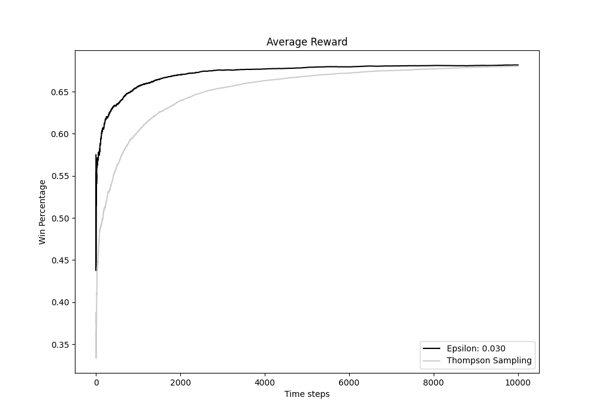
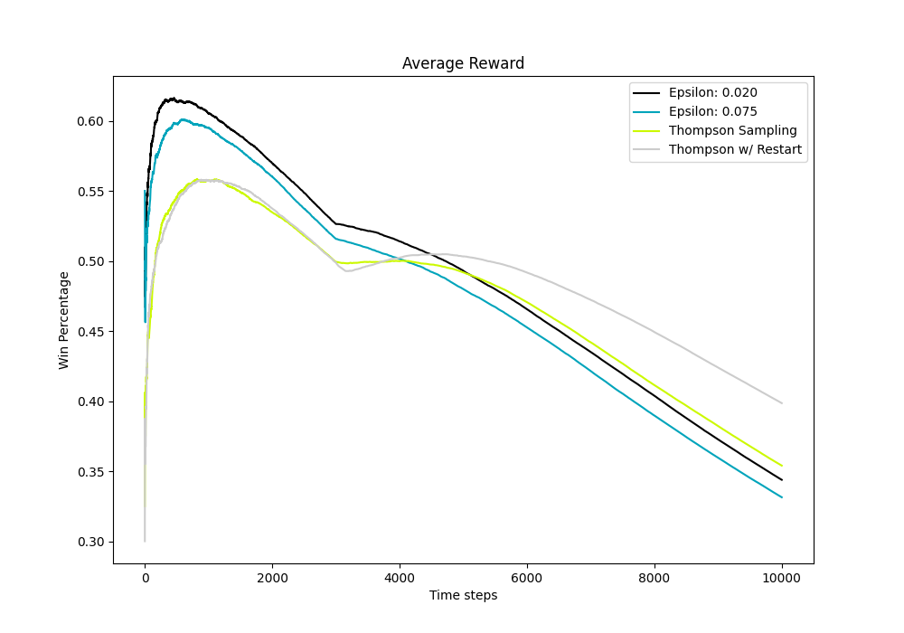

# CS 5060 Homework 2

## Running Code
	To run this code all that needs to be done is run the HWK2_Grogan_Cody file and the following graphs
	should be outputted:

	- Average reward from epsilon greedy for epsilons of 0.01, 0.05, 0.1, and 0.4
	- Average reward for epsilon greedy for various epsilons
	- Average reward with optimal epsilon and thompson sampling
	- Average reward from epsilon greedy with drift for epsilons of 0.01, 0.05, 0.1, and 0.4
	- Average reward for epsilon greedy with drift for various epsilons
	- Average reward with drift for optimal epsilon, thompson, and thompson w/ restart

NOTE: I generate all graphs using the average of 40 runs for each epsilon or thompson sampling strategy

## Problem 1
For this section the reward amount from each arm is determined using a predetermined normal distribution.

	

	The graph above shows average win percentage over 40 episodes of the epsilon greedy algorithm
	with varying values of epsilon. As can be seen the epsilon of 0.05 converges to its steady state win percentage
	much faster than the other epsilons. This is because the value of 0.05 is closest to the perfect ratio of 
	exploration	to exploitation. The ratio can be seen with an epsilon of 0.4 where the algorithm converges to
	slightly under a 60% win rate. This makes sense because the algorithm explores 40% of the time and the optimal
	arm only wins at a certain rate. This then transfers to the other epsilons as the lower epsilons converge to 
	higher win percentages because they exploit their knowledge more frequently.

	

	The graph above shows the average win percentage over 40 episodes in order to find the optimal epsilon value
	to use for the problem. As could have been predicted from the previous graph, the optimal epsilon is between
	0.01 and 0.05. I find the optimal epsilon to be 0.02 because it has much better convergence and to a higher
	win rate. This graph also shows the downfall of having very low epsilons such as 0.01. This is because algorithm
	doesn't explore enough to find the optimal arm and instead gets stuck pulling a sub-optimal arm. This then shows
	the algorithm got lucky and found the optimal arm early in the previous graph.

	

	The graph above shows the difference between the optimal epsilon value and the thompson sampling method. As can be 
	seen, the Thompson sampling method converges much slower than the optimal epsilon. However, this is because the Thompson
	method uses beta distributions which cause quench its exploration as it goes. This means the thompson method has the
	potential to have a higher win rate than the optimal epsilon but will take much longer to get there as seen by the graph.

## Problem 2

For this section, the normal distribution (mean) which outputs the reward for each arm slowly decreases over each time step.
In addition, at a time 3000 random arms get a sudden increase in reward (mean value).

	

	The graph above shows the result of using the predefined epsilon values as outlined in the assignment. The slow decrease
	in reward output is quite obvious as the win rate for all epsilons slowly decreases over time. In addition the small bump
	at time 3000 shows the benefit of slightly bigger epsilons. Meaning a slightly bigger epsilon allowed the algorithm to
	identify the new optimal arm after the sudden increase. As a result of being more adaptable, the higher values of epsilon
	overtake the win rate of epsilon = 0.01.

	

	Much like problem 1, the epsilon of 0.01 gets lucky enough of the time to outperform the more optimal values of epsilon.
	However, the more interesting conclusion drawn from this graph is that all of the epsilons converge to a common win rate.
	This is likely because that their optimal arm drops below the expectation of another arm that hasn't been pulled in a while.
	As a result, the algorithm wastes time exploiting its out of date knowledge instead of sticking with the optimal arm.

	

	This graph shows the average reward of two optimal epsilons, thompson sampling, and thompson sampling with a restart.
	The graph above shows the conclusion drawn from the previous graph where at the time of 3000 it is better to throw out
	the previous expectation than trying to correct for sudden changes. This is shown by the Thompson sampling w/ restart
	greatly outperforming the other three lines. This is because of the nature of exploiting prior information. In the case
	of the epsilon greedy algorithm, it takes a substantial amount of time to move the average of an arm that has 3000 samples.
	In the case of thompson sampling, it takes a significant of losses to reduce the pull frequency of an arm with 3000 wins.
	The cause of epsilon greedy and regular thompson sampling failing in this scenario is because the foundation of both
	assumes that the win rate will converge to some constant. However, in this scenario, the probabilities are always moving
	and fluctuating, which does not allow these these methods to act optimally.

