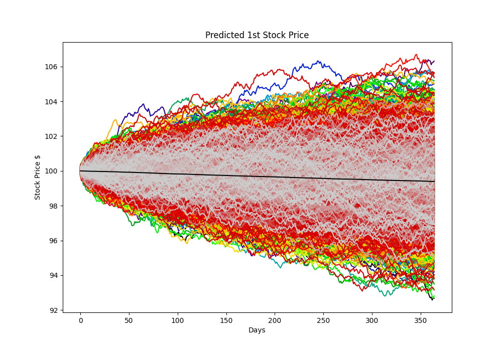

# CS 5060 Homework 3

## Running Code
    To run this code, all that needs be done is run the HWK3_Grogan_Cody.py file and the following information
    and graphs will be outputted:

    - Graphs
        - Stock price path graph with trend (Black line) for target stock
        - Stock price path graph with trend (Black line) for stock 1
        - Stock price path graph with trend (Black line) for stock 2
    
    - Info
        - Fit info Stock 1
        - Fit info Stock 2
        - Price of 100 Euro Call Options w/ strike of 100
        - Price of 100 Euro Call Options w/ strike of average of stock 1 and stock 2
        - Price of 100 Euro Call Options w/ stike of max of stock 1 and stock 2

## Problem 1

For this section I use geometric brownian motion and the provided probability distribution to determine the
change in the stock for each time step.

100 Option Price: $804.39

The graph above shows the result of using geometric brownian motion to model the stock price. As can be seen
the price consistently increases to about $109 dollars over the course of the year. This is because the
distribution the stock follows biased toward increasing than decreasing. As expected from the average end
price the value of 100 call options should be priced at $804 after reducing the average value by the risk
free percentage.

## Problem 2

For this problem I loaded in the data from the provided csv files and began by normalizing the data. I did
this because the GBM function needs a value between 0-1 to correctly predict stock paths. I then used the fitter
library to fit either a beta, lognormal, and normal distribution to the data and chose the best based off of
sum squared error.

- Stock 1:
    - Sum Squared Error:
        - lognormal: 19.05
        - normal: 19.08
        - beta: 19.4
    - Best Fit:
        - lognorm:
            - s: 0.0127
            - location: -15.06
            - scale: 15.57

- Stock 2:
    - Sum Squared Error:
        - lognormal: 26.81
        - beta: 26.81
        - normal: 27.27
    - Best Fit:
        - lognorm:
            - s: 0.047
            - location: -3.33
            - scale: 3.77

I then normalized the initial price of $100 dollars and shifted the distribution to the left that amount.
This then produces distributions which produce GBM paths consistent with the stock trends.

The graph of the paths for stock 1 shows the slightly negative trend of the stock which would increase the call
option price for the target if they were compared directly. However stock 2 shows a significant difference.

The graph of stock 2 shows this stock out prices the target stock and thus would make the call option worthless.
This is then mirrored in the price of the target option with the average and max of stock 1 and 2.

Option Price Average: $99.28

Option Price Max: $0.00

These results make sense because stock 2 increases more than the target stock over the year time period. As a result
the option price with the maximum of the two is worthless and the average of the two is only slightly positive. This
then means there is significantly less risk for a call option that hinges on the stock of multiple other companies because it is likely that one or more will out price the target stock.
