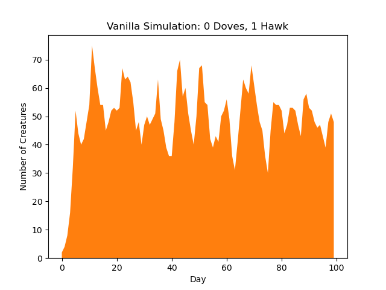
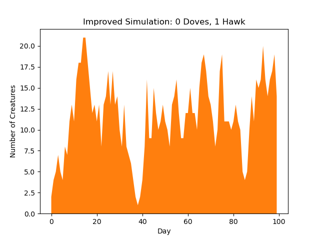
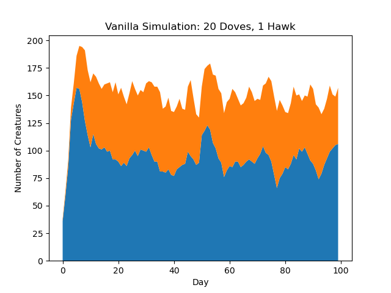
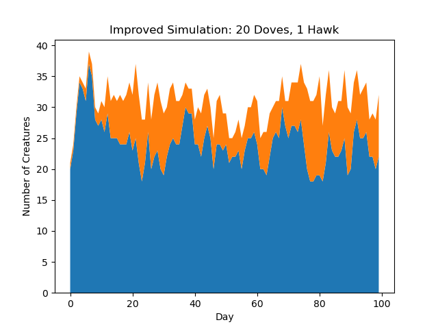

# Simulation

This simulation has 2 main configurations:

### Vanilla
- For this simulation each food location has a maximum of 2 creatures.
- Dove vs Dove: Both survive
- Dove vs Hawk: Hawk 50% reproduce, Dove 50% survival
- Hawk vs Hawk: Neither survive
- Lone creature: 100% reproduction

### Improved

- No maximum creature count for food
- Only Doves: 2/n chance of survival
- 1 Hawk vs Doves: Hawk 100% Survival, Doves 1/n survival
- 2 or more Hawks:
    - Fight System:
        - While there is more than 1 hawk alive
        - Hawk with better score wins and battles next hawk
        - Hawks with even score 0% survival
    - Result:
        - No hawks
            - Doves 2/n survival
        - 1 Hawk
            - No Doves: 100% reproduce
            - Any # doves: Hawk 100% survival, doves 1/n survival

Although the footnotes of the changes are above, this improved model allows for more complex interaction between hawks. If there are 3 hawks and 2 evenly matched hawks fight first. Then the third one gets to continue on without having to fight. However, if 2 lesser matched hawks fight first, then the one that wins gains experience for the next fight giving it a better chance of winning.

## Only Doves

An important simulation to run with both the Vanilla and Improved model are that of a dove only version. The results of this simulation are shown below.

As we can see, the Improved simulation has significantly less carrying capacity for doves as appose to the Vanilla version. This is because, in the Vanilla version, the Doves essentially team up and only decide to got to locations with less than 2 creatures. This effectively guarantees no Dove will cause any other dove to have anything less than 100% survival (even if that means the Dove has to go without food). In the Improved simulation, this teaming is not found, which results in doves picking any food location they can even if that means the other Doves may not survive.

## Only Hawks

Another important simulation to run with both Vanilla and Improved model is one with only hawks. The results are shown below.

What we see in this simulation is a result of the same rule as the doves. If hawks are allowed to pick any food location they would like, more hawks die at each time step. For example, if a dominant hawk chooses a spot with 3 other hawks. The dominant hawk will be the only one to survive and the population will reduce by 3. As a result of the experienced based fights, newly created hawks die at a much greater rate because it is so hard to gain experience when older hawks are around. 

## Hawks and Doves

The final trial for these models is one in which tests the equillibrium between hawks and doves when they are both present. The results are shown below.

The graphs above show the total carrying capacity for creatures in the environment greatly decreases in the Improved model. This is because of the aformentioned interactions between creatures of the same type and creatures of different types. The lack of teamwork between doves, new hawks being severly disadvantaged, and the possibility of killing more than 1 hawk at a food location causes the total population of creatures to severely decline between Vanilla and Improved models

## Imergent Behaviors

What we see in the graphs above is teamwork between species greatly improves the carrying capacity of the environment. More importantly, limiting the interaction between individuals is almost more important than the rules of each interaction. This makes intuitive sense because every interaction between individuals has the possibility to end badly. The improved model has more interactions and thus the equillibrium point has significantly less creatures than the Vanilla model.

        
    

