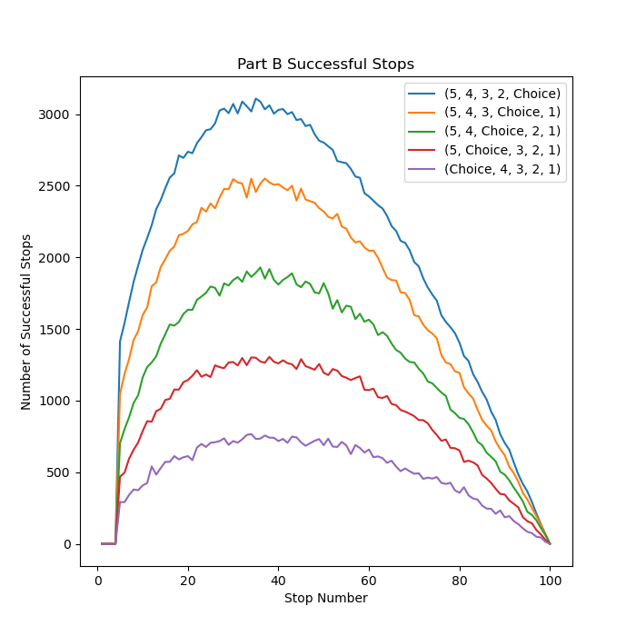
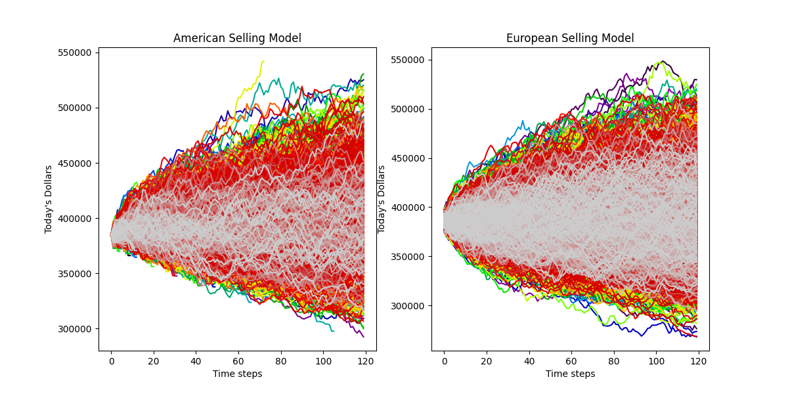
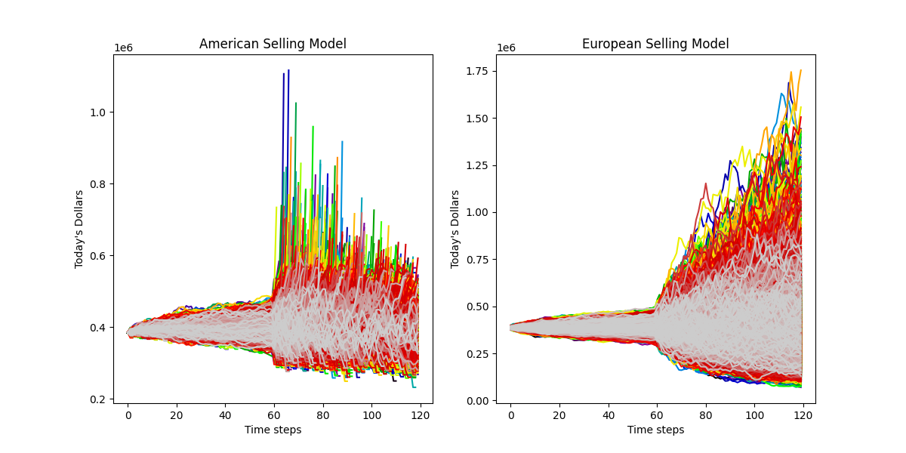

# Problem 1

For this problem I used the vanilla stopping rule of forming an expectation from 0 to stop number and then stopping
the search when the current number exceeded the expectation. The slight twist I added was the addition of what I call
a 'buffer' which contains 5 candidates. Using this buffer I can control where the candidate that exceeded the expectation
is. For example, (1, 2, Choice, 4, 5) means that the algorithm looked 2 additional candidates more than the candidate
that exceeded the expectation.

## Run the Code

To run this code, all that needs to be done is run the python with the prefix Problem_1 the following should be outputted:

* Graph with rejection rate of 50%
* Best buffer, % Success Rate, Stop % for Success Rate

* Graph with 20% rejection and 15% for subsequent canditates
* Best buffer, % Success Rate, Stop % for Success Rate

## Part A

Buffer: (5, 4, 3, 2, Choice)

Success %: 20.54%

Stop %: 36%

### What is the early stopping rule that maximizes the likelihood of obtaining the optimal optimal answer?

The optimal stopping policy from the figure above is stopping when the
expectation is exceeded like the vanilla stopping algorithm situation.
However, the figure above shows there is no significant difference between
each of the different buffer locations. This makes sense because each
applicant has an equally likely chance of rejecting the job offer
regardless of position in the buffer.

### How does this compare with simple early stopping problem?

This result is essentially the same as the simple early stopping problem
in stopping percentage but not in the success percentage. This is because
of the possibility of rejection because the value of 50% rejection explains
why the success percentage is roughly half of the simple early stopping
problem.

## Part B

Buffer: (5, 4, 3, 2, Choice)

Success %: 31.1%

Stop %: 34%

### What is the early stopping rule that maximizes the likelihood of obtaining the optimal optimal answer?

The optimal stopping policy for this problem is to stop as soon as the
expectation is exceeded. This is obvious from the graph above as the buffer
location with the chosen candidate last has the best performance. This is
because the rejection percentage increases with each successive candidate.
This decentivizes the algorithm from looking at candidates past the chosen
because the rejection % increases.

### How does this compare with simple early stopping problem?

This iteration of the early stopping problem comes even closer to the simple
early stoppig problem because the base rejection % is much lower than the
part A. This then proves the conclusion from part A because the success % is
roughly 20% lower than the simple early stopping success rate. This means 
that the addition of a buffer does nothing to the optimal stopping policy.

# Problem 2

For this problem I use the epsilon greedy algorithm to determine the best
location to put a sensor. In this algorithm, the quality function I use is
the average reward from each site over time. Then I run the algorithm over
500 potential days and 500 episodes and average the outcomes of each
episode. This allows me to determine the average convergence speed to 
a particular site.

## Run the Code

The file for this problem has the prefix Problem__2 and the following is
outputted:

* Q graph w/o baseline
* Percent picked of each site w/o baseline
* Total days, Number of days skipped
----
* Q graph w/ baseline
* Percent picked of each site w/ baseline
* Total days, Number of days skipped

## Part A

Optimal Area: beta(7,3) + 2 or 1st location

Epsilon: 0.1

### How many days will it take for you to make the decision to place the permanent sensor?

The graph above shows the algorithm converges in roughly 50 days rather
consistently with an epsilon of 0.1. 

## Part B

Optimal Area: normal(1.3, 7) or 5th site

Epsilon: 0.1

Number of days Skipped: 246/500

### Does this change the final decision of the placement

The addition of the baseline significatly changes the permanent sensor site
because it reduces the values outputted from each distribution. This greatly
favors the non-terminating distributions such as the normal distribution
because the highly negative tail values are never recorded thus shifting the
the q value. This is evident from the number of days skipped because the
normal distribution had the highest q value but nearly 50% of data points 
were thrown out. Meaning the 5th site was below the baseline 50% of the time
which should have disqualified it from being the optimal area.

### How long does it take before you choose to place the sensor?

Based on the graph, the time it took to place the sensor should be around
the area where site 5 overtook site 1 in the % picks graph. This is because
the it is fairly random when the greedy algorithm determines the 5th site
is the best. Thus the % pick graph is the most indicative of convergence 
time at 250-300 days.

# Problem 3

For this problem I used the equation for geometric brownian motion to
simulate the property price over the time period. In addition to the
problem, I calculated the value in today's dollars using an normal 
distribution with mean of 4% and std dev of 1%. I also added a
normal distribution with mean 1000 and std dev of 1000 to represent
the profit from the store every month. Finally on the american option
(lease to own) I changed the sell condition to:

* Sell if price + profit is less than starting price
* Sell if price is greater than 535,000 and if projected derivative from previous 4 points is negative

## Run the Code

The file for this problem has the prefix of Problem_3 and the following
should be outputted:

* Graph of price paths for American and European w/o volatility change
* Average profit for American w/o volatility change
* Average store price American w/o volatility change
* Average profit for European w/o volatility change
* Average store price European w/o volatility change
--------------------
* Graph of price paths for American and European w/ volatility change
* Average profit for American w/ volatility change
* Average store price American w/ volatility change
* Average profit for Euro w/ volatility change
* Average store price American w/ volatility change

## Part A

* American:
    + Profit: $21,273
    + Store Price: - $7055

* European:
    + Profit: $72,839
    + Store Price: - $23,321

### What is the value to us of a American lease-to-own contract?

The lease-to-own or american option provides the smallest store profit and best store
selling price over 10,000 iterations. The smallest store profit is due to the early selling
of the stores which causes the stores to lose profit from merchandise. The best store price
is due to the algorithm being able to sell the store before it becomes too negative.

### How does it compare to the standard lease-to-own?

The standard lease to own greatly out performs profit the American style option because the
market fairly stable and the profit coming into the store from merchandise largely
out produces the loss in value of the store. It does not perform as well as the American
option in store price because the store cannot be sold until the very end of the lease.
However this nmumber is negligable compared to the profit of merchandise.

## Part B

* American
    + Profit: $10,627
    + Store Price: - $7,881

* European
    + Profit: $56,308
    + Store Price: - $37,983

### How do American lease-to-own prices change?

The American style lease-to-own generally has the same amount of profitability as the
the low volatility simulation. This is because the store can be sold at anytime especially
when the store drops significantly in value. As a result the American style lease-to-own is 
significantly more stable in highly volatile markets.

### How do European lease-to-own prices change?

The European style lease-to-own performs significantly worse with respect to overall profit
and store selling price. This shows the instability of the european style because its overall
profit varies significantly with volatility. In addition, if the profit from the merchandise 
were to become more volatile the store would likely lose even more value as most of the profitability
of the store relies on the profit from merchandise.

# Problem 4

### What is making sense and what doesn't?

I would say that, in general, I usually go into the homeworks knowing exactly how to do the 
first problem and needing to ask some questions about the second. However, I think this is the
intention of the homework problems. Have an easy question to put your feet under you and a harder
question to test your understanding of the topic. After doing the homeworks, I feel I could implement
the following algorithms:
- Optimal Stopping
- Explore vs Exploit
- Options pricing/ Monte Carlo Simulation
- Decent idea on hedging and how to do it

### How can I do this better?

I dont truly know how to do this any better because there is such a large trade-off between
explaining a method as rigourously as possible and going over a lot of methods at more
general level. On the rigorous approach, the class is a lot easier but  will feel a lot
more like brainlessly implementing code with little variation. On the more general approach,
the class is harder, but the problem solving and learning outside of class will be a lot higher.
I prefer the general level but I know a lot of people prefer the easiest class possible. 

